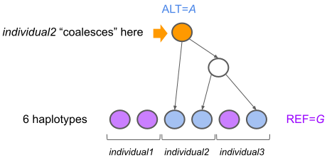

Filtering Details
=================

See the :ref:`filtering_apis` section for detailed description of Python-based filtering behavior. Here we describe some general
considerations when filtering data, and corner cases that are helpful to be aware of.

GRG Representation of Zygosity
------------------------------

The GRG only explicitly represents the ALT allele and its relationship to haplotypes, in the same way that a
sparse matrix representation only represents non-zero entries. This representation is extremely efficient for
most operations, but can result in some ambiguity when considering genotypes for non-haploid individuals at
multi-allelic sites.

Consider counting the number of diploid homozygotes ``HOM(x)`` for each allele ``x``, for all bi-allelic sites.
For a tabular data format, we would scan all variants, obtain their genotypes per individual, and then count
the number of ``2`` values to get ``HOM(ALT)``, and the ``0`` values to get ``HOM(REF)``. Straight-forward, if inefficient.
For GRG, we can compute ``HOM(ALT)`` via a graph traversal that makes use of the individual coalescences stored
in the GRG (see `concepts <https://grgl.readthedocs.io/en/stable/concepts.html>`_): at each node in the graph
we know the number of individuals (vs. haplotypes) that are descendant of the node.

In the above diagram, the orange node is our mutation node (representing the ALT allele). The blue samples
nodes are haplotypes containing the ALT, purple sample nodes are haplotypes containing the REF. The haplotypes
for *individual2* coalesce at the orange node, indicating it has ``HOM(ALT) = 1``. We can also get ``HET(ALT) = 1``
from the graph. Let ``AC(ALT) = 2 * HOM(ALT) + HET(ALT)`` be the allele count, and ``N`` be the number of haplotypes.
Then for bi-allelic sites we can compute ``HET(REF) = HET(ALT)`` (all heterozygotes are completely determined)
and ``HOM(REF) = N - AC(ALT)``.

When a site is multi-allelic, all heterozygotes are not completely determined. Thus we cannot determine ``HET(REF)``
and ``HOM(REF)`` using the coalescence information in the graph. Consider a tri-allelic site, ``REF, ALT1, ALT2``.
Then we can consider two extremes: the heterozygotes of ``ALT1`` and ``ALT2`` completely overlap, in which case
``HET(REF) = 0`` because there are no heterozygotes remaining for ``REF`` to "pair with". On the other hand, the
heterozygotes of ``ALT1`` and ``ALT2`` could be completely disjoint, in which case ``HET(REF) = HET(ALT1) + HET(ALT2)``.
There are additional constraints on ``HET(REF)``, and as the number of alleles grows (beyond tri-allelic) the
relationships get more complex.

Hardy-Weinberg Filtering
------------------------

The HWE p-values computed by ``grapp`` compare the case of having each allele against *not having* that
allele. For bi-allelic sites, the p-value for ``(ALT, not ALT)`` is the same as ``(REF, not REF)``. For multi-allelic
sites, computing the ``(REF, no REF)`` p-value is much less efficient than for bi-allelic sites.

By default, all of the ``(ALT, not ALT)`` p-values for multi-allelic sites are computed and used for filtering, but
the ``(REF, no REF)`` p-value is not. The user can request the REF p-values to be computed, at the cost of slower
filtering (the command line option is ``--multi-ref``).

If the any allele fails the HWE p-value filtering threshold, the entire site is filtered out.

Missing alleles pose the same problem as multi-allelic sites: we cannot in general determine the zygosity
of the REF in the presence of arbitrary missingness. For bi-allelic sites, ``grapp`` *assumes* that all
missingness is per-individual and thus that ``HET(REF) == HET(ALT)``: a warning will be emitted when this
assumption is violated.

Filtering by number of alleles
------------------------------

Filtering by number of alleles (``grapp filter -M`` and ``-m``) uses the *total unique allele count* at the site,
including all REF and ALT alleles. This is equivalent to the behavior of `bcftools <https://samtools.github.io/bcftools/bcftools.html>`_
on a *normalized* VCF file (``bcftools view -M`` and ``-m``).

Site vs. variant filtering
--------------------------

================= ===============
Filter command    Site or variant
================= ===============
``--range``       Site (by definition)
``--min-ac``      Variant
``--max-ac``      Variant
``--types``       Variant
``--min-alleles`` Site
``--max-alleles`` Site
``--HWE``         Site
================= ===============

All variant-based filters are converted to site-based filters when the ``--apply-to-sites``
option is used.

Arbitrary filtering
-------------------

``grapp`` provides APIs and command line options for commonly used filtering patterns. Users can always implement
their own custom filtering approach (e.g., if they prefer filtering out variants instead of sites in certain cases).
See :py:meth:`grapp.util.filter.grg_save_mut_filter` or `pygrgl.save_subset <https://grgl.readthedocs.io/en/stable/python_api.html#pygrgl.save_subset>`_
for arbitrary filtering.